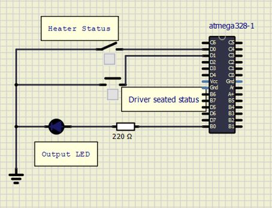

# Embedded C Programming Examples with Continuous Integration and Code Quality

# Seat Heating Application 

### Activity-1
Turn LED status when driver is seated and has turned on the heater button.

### Activity-2
Take temperature reading from the temperature sensor(used as potentiometer in sumilation).

### Activity-3 
Print PWM output with duty cycle depending on the temperature from sensor.

### Activity-4
Print the temperature reading(in ˚C) on the serial monitor.

PWM output and temperature displayed on the serial monitor will be according to the table below.

| ADC Value(Temp sensor) | Output PWM |  Display temperature |
|:----------------------------:|:---------------:|:-----------------------:|
|  0-250 | 20% | 22˚C |
| 251-500 | 40% | 25˚C |
| 501-750 | 70% | 29˚C |
| 751-1024 | 95% | 33˚C |

## In Action
|ON|OFF|
|:--:|:--:|
||Case-1 Case-2  Case-3 |

###Final Simulation

